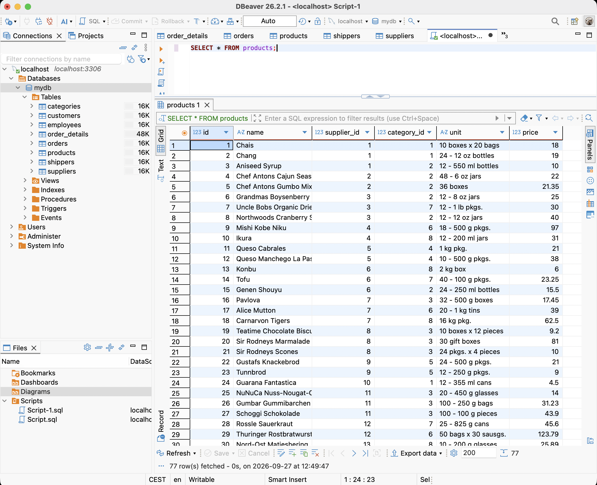
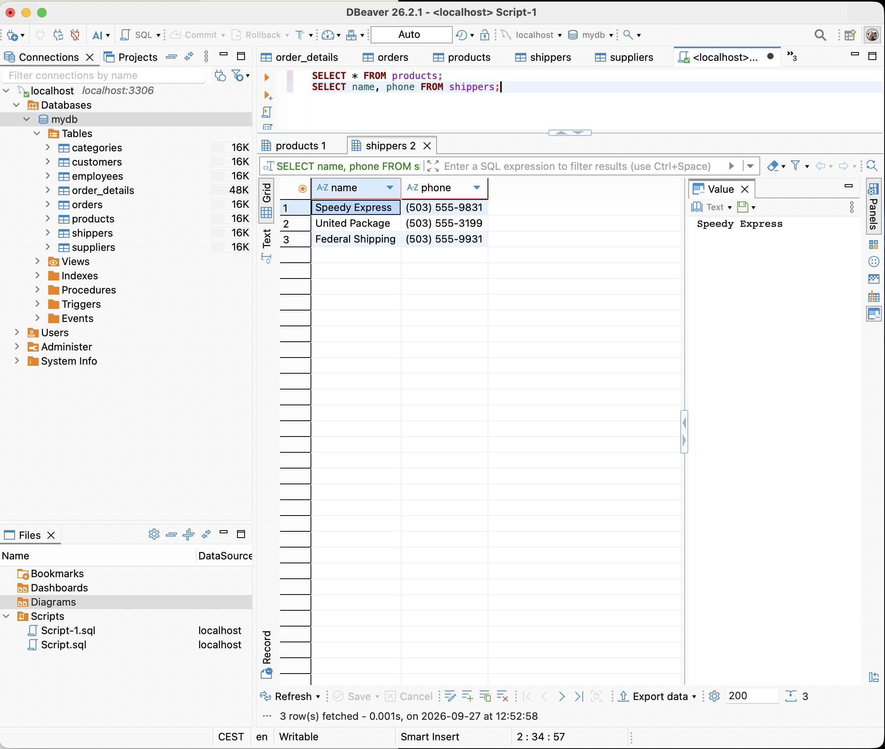
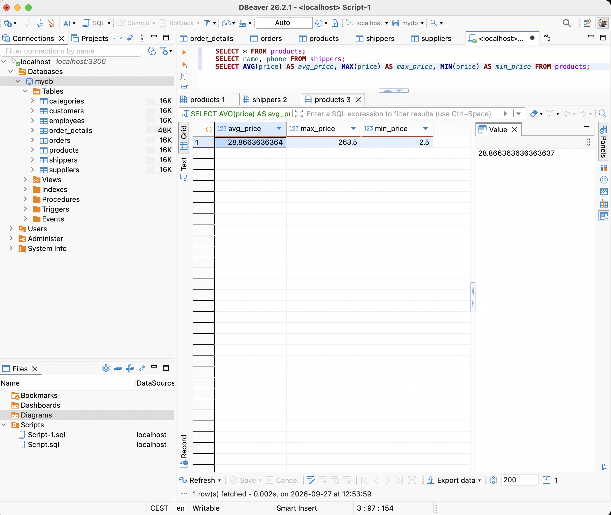
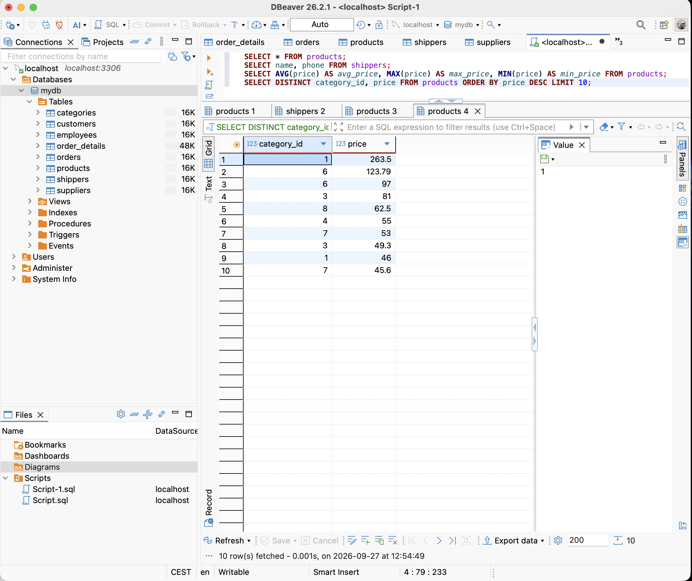
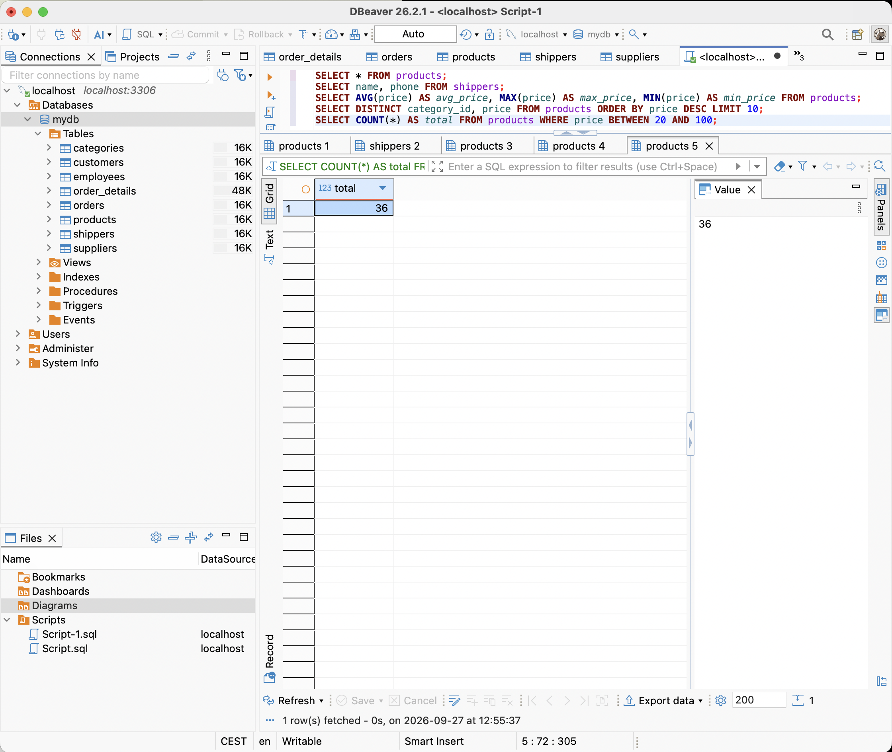
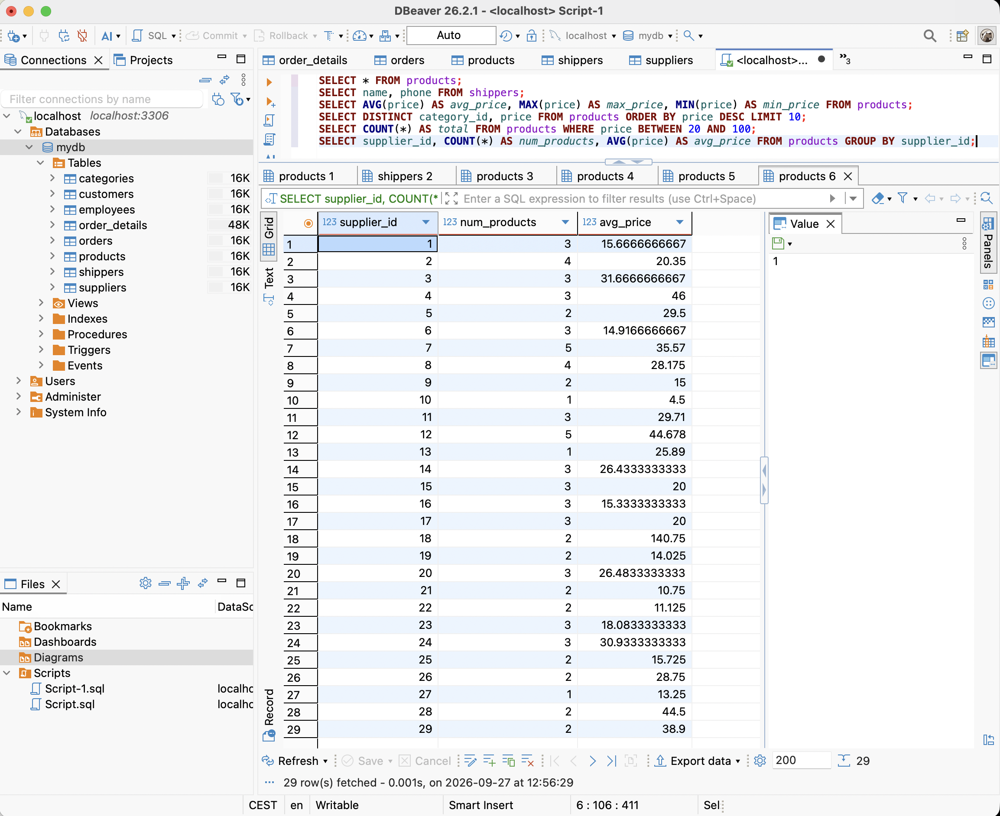

# Домашнє завдання до Теми 3. Завантаження даних та основи SQL. DQL команди

- У цьому домашньому завданні вам необхідно застосувати свої знання для отримання конкретної інформації із завантаженого раніше (у конспекті до теми 3) датасету, а саме написати кілька SQL команд — запитів до даних.

### Підготовка та завантаження домашнього завдання

1. Створіть публічний репозиторій `goit-rdb-hw-03`.
2. Якщо раніше ви не завантажували [цей архів](https://drive.google.com/file/d/1B45tkzH3lIrf2CmQIB2VB0AJRB9Ly7c2/view "Натисни щоб скачати") з даними у форматі `csv`, зробіть це зараз.
3. Виконайте завдання та відправте у свій репозиторій скриншоти запитів і результатів, а також текст SQL коду в текстовому файлі.
4. Завантажте скриншоти і текстовий файл на свій комп’ютер та прикріпіть їх в LMS архівом. Назва архіву повинна бути у форматі ДЗ3_ПІБ.
5. Прикріпіть посилання на репозиторій `goit-rdb-hw-03` та відправте на перевірку.

### Формат здачі

- Прикріплені файли репозиторію архівом із назвою ДЗ3_ПІБ.
- Посилання на репозиторій.

## Опис домашнього завдання

1. Напишіть SQL команду, за допомогою якої можна:

• вибрати всі стовпчики (За допомогою wildcard “\*”) з таблиці “products”;
• вибрати тільки стовпчики name, phone з таблиці shippers,
та перевірте правильність її виконання в MySQL Workbench.

2. Напишіть SQL команду, за допомогою якої можна знайти середнє, максимальне та мінімальне значення стовпчика price таблички products, та перевірте правильність її виконання в MySQL Workbench*.*

3. Напишіть SQL команду, за допомогою якої можна обрати унікальні значення колонок category_id та price. Оберіть порядок виведення на екран за спаданням значення price та виберіть тільки 10 рядків. Перевірте правильність виконання команди в MySQL Workbench.

4. Напишіть SQL команду, за допомогою якої можна знайти кількість продуктів (рядків), які знаходиться в цінових межах від 20 до 100, та перевірте правильність її виконання в MySQL Workbench.

5. Напишіть SQL команду, за допомогою якої можна знайти кількість продуктів (рядків) та середню ціну (price) у кожного постачальника (supplier_id), та перевірте правильність її виконання в MySQL Workbench.

### Критерії прийняття

1. Прикріплені посилання на репозиторій goit-rdb-hw-03 та безпосередньо самі файли репозиторію архівом.

2. Правильно написано всі 6 команд. SQL команди виконуються й повертають необхідні дані.

### Результат виконаного ДЗ:

1. Вибір стовпчиків

-- Всі стовпчики з таблиці products
SELECT \* FROM products;

-- Тільки стовпчики name, phone з таблиці shippers
SELECT name, phone FROM shippers;

2. Середнє, максимальне та мінімальне значення price

SELECT AVG(price) AS avg_price, MAX(price) AS max_price, MIN(price) AS min_price
FROM products;

3. Унікальні значення category_id та price, сортування за спаданням price, перші 10 рядків

SELECT DISTINCT category_id, price
FROM products
ORDER BY price DESC
LIMIT 10;

4. Кількість продуктів з ціною від 20 до 100

SELECT COUNT(\*) AS total
FROM products
WHERE price BETWEEN 20 AND 100;

5. Кількість продуктів та середня ціна для кожного постачальника

SELECT supplier_id, COUNT(\*) AS num_products, AVG(price) AS avg_price
FROM products
GROUP BY supplier_id;

